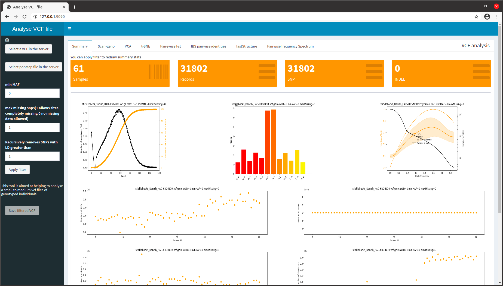

# ShinyVCFMultiSampleanalyser
This tool is aimed at helping to analyse small to medium vcf files of genotyped individuals.

If a file mapping individuals to populations is provided, most plots will be decorated with population info, and pairwise Fst as well as Faststructure can be conducted.

Multi-populations AFS spectrum analyses with moments are also available to test up to 24 demographic models using a dual-annealing optimization method.

A bunch of tools are also availbale to manually scan regions of the genome for :

* Genotype distribution over samples
* Pairewise missingness correlated to Identity by state (IBS)
* Scans of Fst, Pi and Dxy highlighting putative outliers (Fst values > a local quantile threshold)

An example of vcf file and popmap file can be found in example directory. This is a subset of data extracted from the Dryad dataset : https://doi.org/10.5061/dryad.kp11q of Ferchaud et al. 2015.

Important :

popmap file must list samples in the same order as in the vcf/bcf file !

To get the ordered list of samples in your vcf/bcf :

``` bcftools query -l my.vcf.gz ```

The popmap must be a text file of two columns separated by a tabulation. The first column is the sample names and the second is the population names.


ShinyVcfAnalyser is available as a docker image in dockerhub or by cloning this repository and building a new image.

## If docker is not installed check howto do here : 

  https://docs.docker.com/engine/install/


## Use of the image on docker Hub

Pull the last available version from Docker Hub registry :

```docker pull mbbteam/shinyvcfanalyser ```

If you choose this solution, you have to refer to the image as mbbteam/shinyvcfanalyser in the commands that follow.

## Download or unzip files to build a new image

 `git clone https://github.com/BELKHIR/shinyvcfanalyser`
 
 then
 
 `cd shinyvcfanalyser`


## Build the Docker image (to be done only once)
`sudo docker build -t shinyvcfanalyser .`

## Now you have to bind directories from your system to directories inside the container
  
bind local directories to /Data and /Results in the container
  
e.g. I want to share my files in /home/khalid/projets/workspace/testData and get results in /tmp/Results
  
`DOCK_VOLUME="--mount type=bind,src=/home/khalid/projets/workspace/testData,dst=/Data --mount type=bind,src=/tmp/Results,dst=/Results"`
  
## To run with binding and mapping host tcp port 9090 to port 3838 in the container (named vcfmultisample)

`sudo docker run --rm -d -p 9090:3838 $DOCK_VOLUME --name vcfmultisample shinyvcfanalyser`

The app is now accessible via a browser at : http://127.0.0.1:9090




## The running container can be alternatively accessed in command line this way :

`sudo docker exec -i -t  vcfmultisample /bin/bash`

This will open a bash console inside the container.  
Some binaries are installed in /opt/biotools  

## To run a new container only in command line :

`sudo docker run --rm -i -t $DOCK_VOLUME --name vcfmultisample shinyvcfanalyser /bin/bash `  


## Generate a report from command line

`cd /sagApp/`

in this example  we want to generate a pdf/html report for a VCF file located in /Data/snps.vcf.gz and its population info in /Data/popmap.txt  

This will be run with default parameters :  

`Rscript -e 'rmarkdown::render("finalReport.Rmd",output_format ="pdf_document", params = list(vcf="/Data/snps.vcf.gz", popMap="/Data/popmap.txt") )'`

This will generate a file named finalReport.pdf .  

To get html output set output_format ="html_document" in the command line.  


You can set some parameters by editing the file finalReport.Rmd and change one or several options in the params section :  

params:  
    vcf: ""  
    popMap: ""  
    globalmaxMissing: 1  
    globalminMAF: 0  
    maxLD: 0.8  
    chr_geno_plot: 1  
    start_geno_plot: 1  
    maxSnp_geno_plot: 500  
    expectedK: 3  
    demoPOP1: 1  
    demoPOP2: 2  
    testModel: "IM"  
    optiMethod: "optimize_log"  
    palette: "Set3"  
    seed: 4321  


